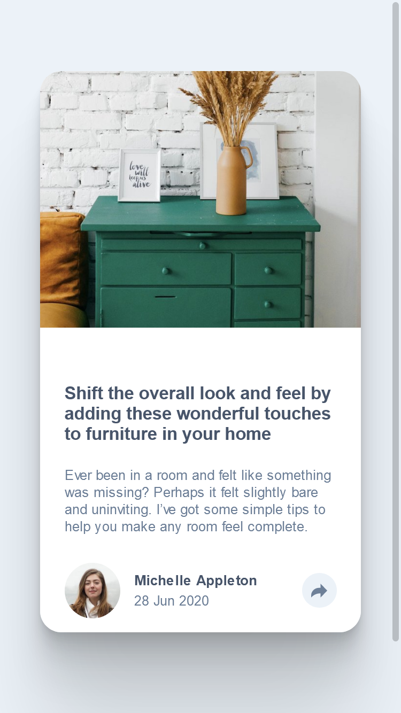
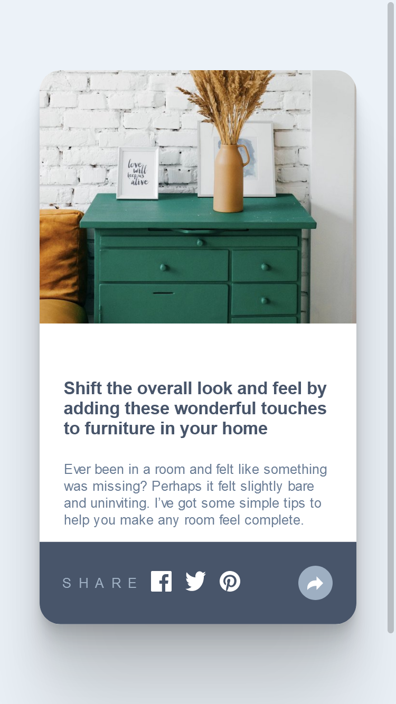
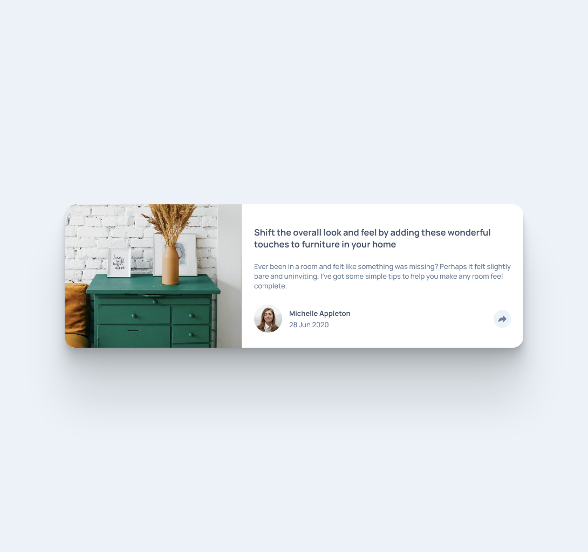
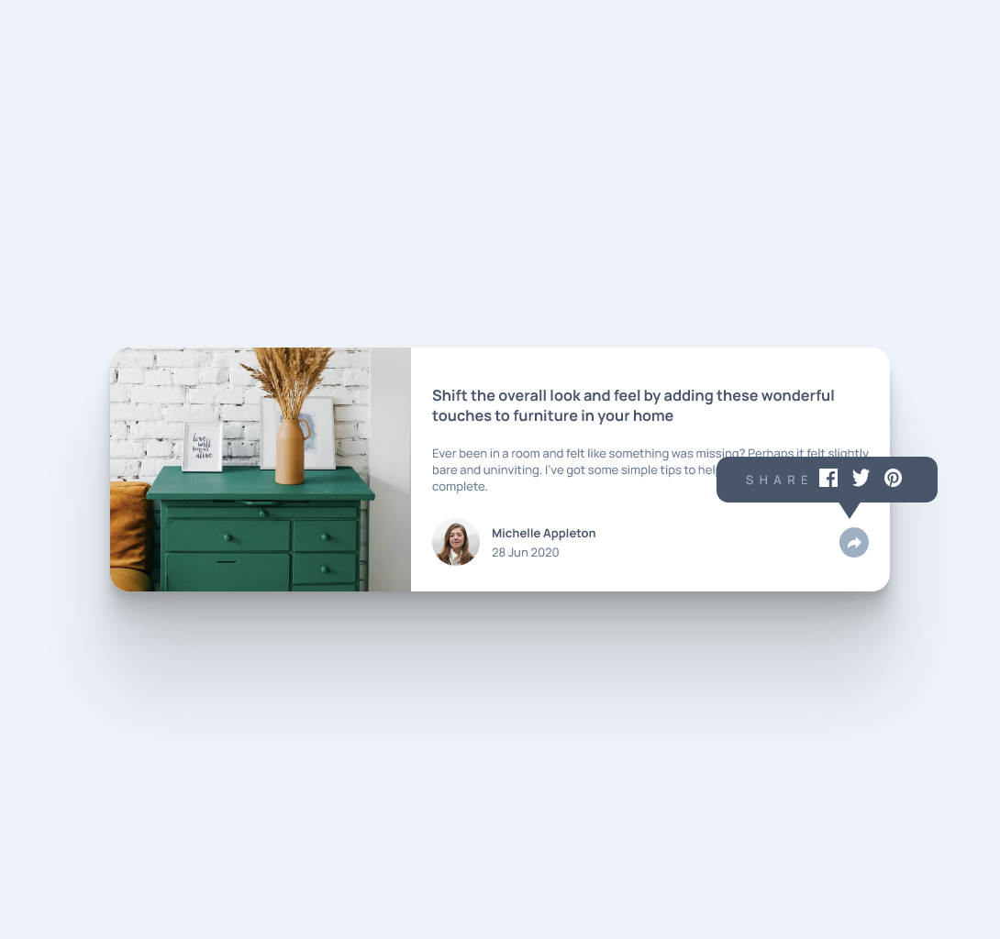

# Frontend Mentor - Article preview component solution

This is a solution to the [Article preview component challenge on Frontend Mentor](https://www.frontendmentor.io/challenges/article-preview-component-dYBN_pYFT). Frontend Mentor challenges help you improve your coding skills by building realistic projects. 

## Table of contents

- [Frontend Mentor - Article preview component solution](#frontend-mentor---article-preview-component-solution)
  - [Table of contents](#table-of-contents)
  - [Overview](#overview)
    - [The challenge](#the-challenge)
    - [Screenshot](#screenshot)
  - [My process](#my-process)
    - [Built with](#built-with)
    - [What I learned](#what-i-learned)
  - [Author](#author)


## Overview

### The challenge

Users should be able to:

- View the optimal layout for the component depending on their device's screen size
- See the social media share links when they click the share icon

### Screenshot
*Mobile view*



*Mobile view with share button clicked*



*Desktop view*




*Desktop view with share button clicked*





## My process

### Built with

- Semantic HTML5 markup
- CSS custom properties
- Vanilla JS
- Flexbox
- Mobile-first workflow


### What I learned

Use this section to recap over some of your major learnings while working through this project. Writing these out and providing code samples of areas you want to highlight is a great way to reinforce your own knowledge.

Biggest takeaway from this was learning how to manipulate svg through js. I didn't want to use any libraries for the manipulation so I decided to dig through the svg object hierachy to figure out which part I was able to use to manipulate the fill. 

My solution to manipulating the svg:

```js
  let svg = document.getElementById('share-icon').getSVGDocument().childNodes[0].childNodes[0]
  if(toggle){
    svg.style.fill="white"
  }
  else{
    svg.style.fill=""
  }
  toggle = !toggle
}

```
## Author
- Frontend Mentor - [@gylim0604](https://www.frontendmentor.io/profile/gylim0604)
